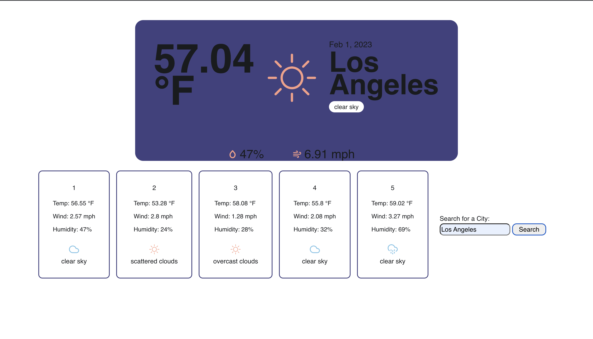

# Weather Dashboard Week 6

## **Description** 

This application shows the weather for the current day and a 5 day forecast for whatever city you search. Soon there will be a function that stores you recent search history and you will be able to click on the recent search to pull up the weather data

## **Installation**

N/A
## **Usage**

To use this weather dashboard simply just type the name of the city you would like to know the weather for and click the search button.
>### To view the deployed site click [here](https://sadiemantlo.github.io/weather-dashboard-week6/)

